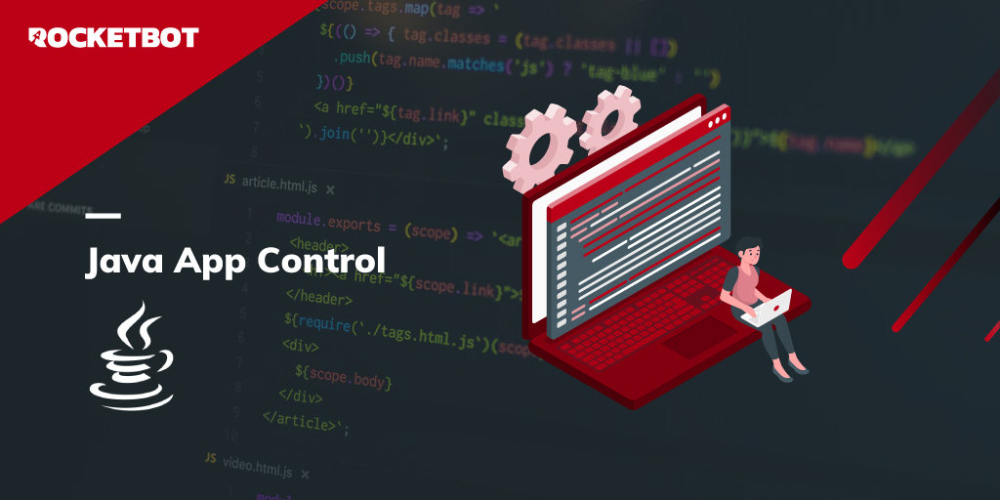

# JavaAppControl
  
Módulo para clickear, escribir y extraer texto de aplicaciones Java  

*Read this in other languages: [English](Manual_JavaAppControl.md), [Português](Manual_JavaAppControl.pr.md), [Español](Manual_JavaAppControl.es.md)*
  

## Como instalar este módulo
  
Para instalar el módulo en Rocketbot Studio, se puede hacer de dos formas:
1. Manual: __Descargar__ el archivo .zip y descomprimirlo en la carpeta modules. El nombre de la carpeta debe ser el mismo al del módulo y dentro debe tener los siguientes archivos y carpetas: \__init__.py, package.json, docs, example y libs. Si tiene abierta la aplicación, refresca el navegador para poder utilizar el nuevo modulo.
2. Automática: Al ingresar a Rocketbot Studio sobre el margen derecho encontrara la sección de **Addons**, seleccionar **Install Mods**, buscar el modulo deseado y presionar install.  

## Descripción de los comandos

### Conectar ventana
  
Conectar una ventana
|Parámetros|Descripción|ejemplo|
| --- | --- | --- |
|Selector|Selector de ventana Java|{ "title": "Titulo ventana" }|
|No Maximizar|Si se selecciona, la ventana no se maximizará.|False|
|Resutlado|Variable donde se almacena el resultado sin {}|{resultado}|

### Click
  
Hace un click en un componente Java
|Parámetros|Descripción|ejemplo|
| --- | --- | --- |
|Selector|Propiedad de texto utilizada para encontrar un elemento de IU particular cuando se ejecuta la actividad.|...|

### Obtener Texto
  
Extrae un valor de texto de un elemento de IU Java especificado.
|Parámetros|Descripción|ejemplo|
| --- | --- | --- |
|Selector|Propiedad de texto utilizada para encontrar un elemento de IU Java particular cuando se ejecuta la actividad. |...|
|Resultado|Variable donde se almacena el resultado sin {}|{resultado}|

### Set Text
  
Le permite escribir una cadena en el atributo texto de un elemento de IU Java especificado.
|Parámetros|Descripción|ejemplo|
| --- | --- | --- |
|Selector|Propiedad de texto utilizada para encontrar un elemento de IU Java particular cuando se ejecuta la actividad.|...|
|Texto|Texto o variable que se vá a escribir en el atributo text del objeto Java.|Texto|
